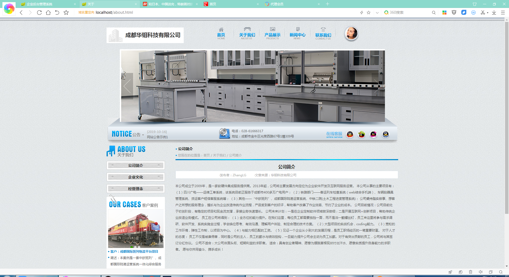
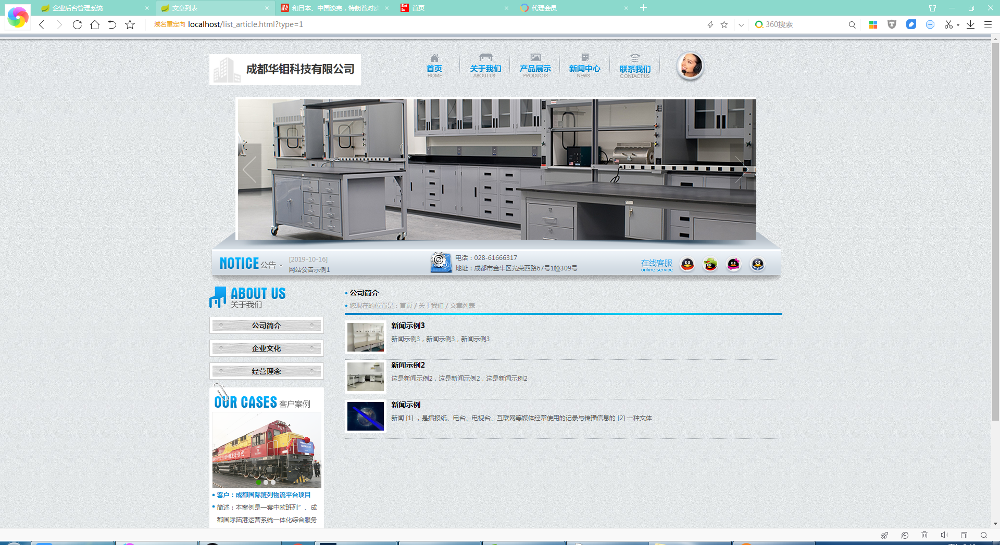
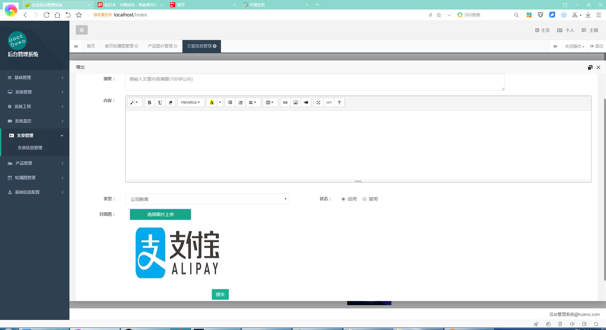
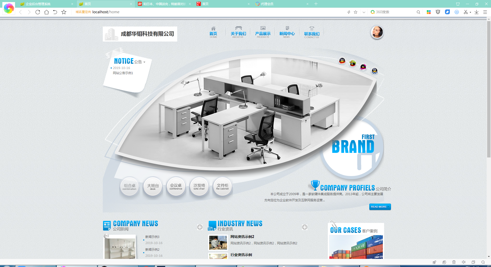

基于Springboot框架实现的企业门户完整前后端系统
=
###  完整代码获取地址：从戎源码网 ([https://armycodes.com/](https://armycodes.com/))
###  作者微信：19941326836  QQ：952045282 
###  承接计算机毕业设计、Java毕业设计、Python毕业设计、深度学习、机器学习
###  选题+开题报告+任务书+程序定制+安装调试+论文+答辩ppt 一条龙服务
###  毕业设计所有选题地址:(https://github.com/3212618475/allProject)

一、项目介绍
---
基于SpringBoot框架实现的企业门户完整前后端系统，有用户和管理员两个角色，主要功能如下

### 【前台功能】
首页、关于我们、产品展示、新闻中心、联系我们

### 【后台功能】
基础管理：文件管理
系统管理：用户管理、角色管理、系统菜单、部门管理
系统监控：在线用户、系统日志、运行监控
文章管理：文章信息管理、
产品管理：产品图片管理
轮播图管理：首页轮播图管理、轮播图类型管理

二、项目技术
---
二、项目技术
编程语言：Java
项目架构：B/S架构
数据库：MySQL
【前端框架】
JS框架：jQuery
客户端验证：JQuery Validation
富文本在线编辑：summernote
数据表格：bootstrapTable
弹出层：layer
树结构控件：jsTree
【后端框架】
核心框架：SpringBoot
安全框架：ApacheShiro
模板引擎：Thymeleaf
持久层框架：MyBatis
数据库连接池：AlilbabaDruid
缓存框架：Ehcache、Redis
日志管理：SLF4

三、运行环境
---
操作系统：Windows、macOS都可以
JDK版本：JDK1.8以上都可以
开发工具：IDEA、Ecplise、Myecplise都可以
数据库: MySQL5.7以上都可以
Tomcat：任意版本都可以
Maven：任意版本都可以

四、项目截图
---
使用截图

